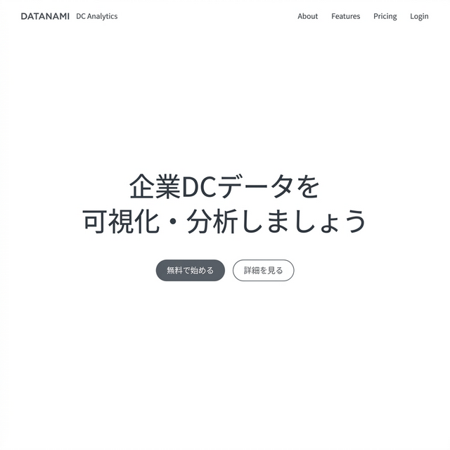
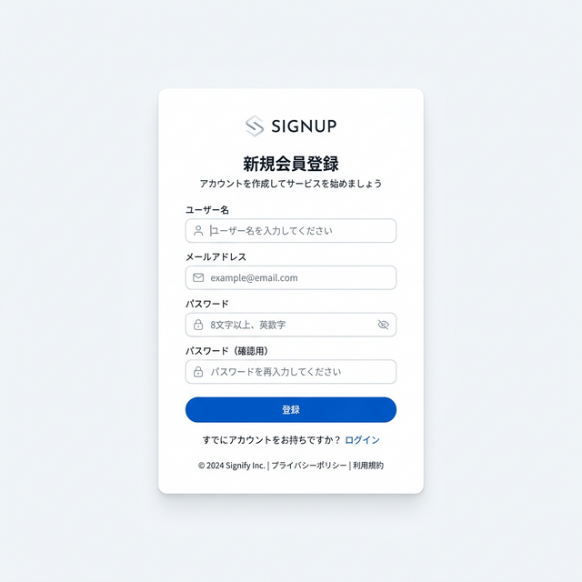
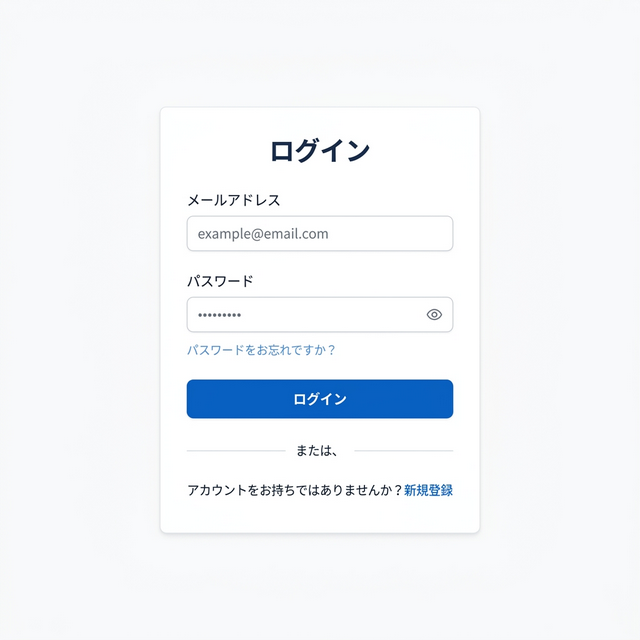
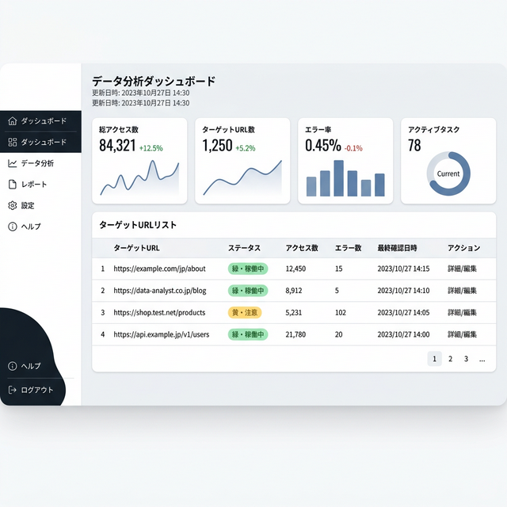
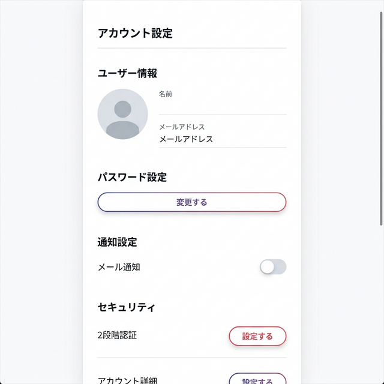
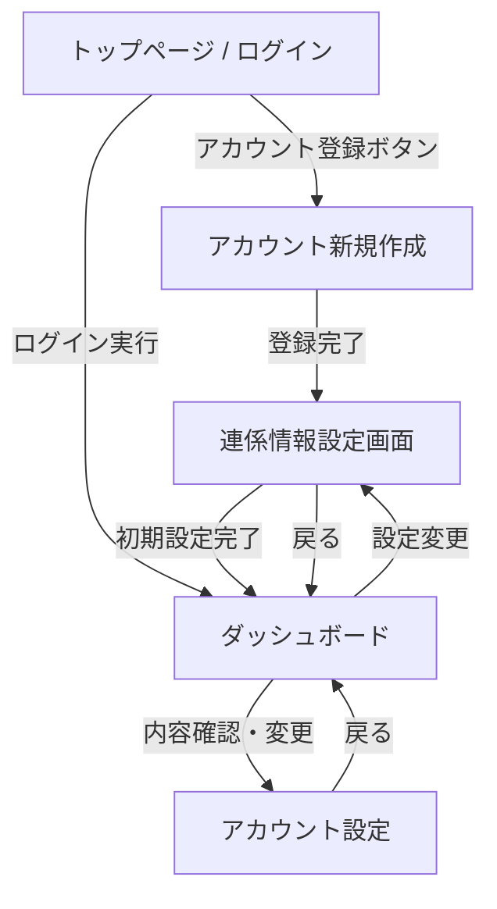

# 画面設計書

本ドキュメントでは、DcScrapingPlatform の各画面の構成、機能、および画面遷移について定義します。

## 共通デザインコンセプト
- **テーマ**: ライトモード（クリーン・洗練）
- **UI要素**: 白を基調とした清潔感のある背景、繊細なシャドウ、柔らかなブルーのアクセント
- **フォント**: Inter または Roboto（クリーンなサンセリフ体）

---

### 画面構成
- **ヒーローセクション**: 
    - キャッチコピー：「企業DCデータを可視化・分析しましょう」
    - **ログイン入力欄**: メールアドレス、パスワード
    - **アクションボタン**: 
        - 「ログイン」ボタン
        - 「アカウント新規作成」への誘導リンク/ボタン
- **フッター**: 
    - リンク（利用規約、プライバシーポリシー）
    - コピーライト

### モックアップ

---

## 2. アカウント新規作成
ユーザーがサービスを利用するためのアカウントを登録する画面。

### 入力項目
- メールアドレス
- パスワード
- パスワード（確認用）

### 機能
- バリデーション（メール形式、パスワード強度、一致確認）
- 「登録」ボタン

### モックアップ

---

## 3. ログイン
既存ユーザーがシステムにアクセスするための画面。

### 入力項目
- メールアドレス
- パスワード

### 機能
- ログイン保持チェックボックス
- 「パスワードを忘れた場合」リンク
- 「ログイン」ボタン

### モックアップ

---

## 4. ダッシュボード
ログイン後、ユーザーがスクレイピング状況を確認・操作する中心的な画面。

### 画面構成
- **サイドバー**: 
    - ダッシュボード（現在地）
    - 連係情報設定（旧：初期設定）
    - スクレイピング設定
    - 履歴・レポート
    - アカウント設定
- **メインコンテンツ**: 
    - **サマリーカード**: 実行中のタスク数、総取得データ数、エラー発生数
    - **タスク一覧表**: 
        - ターゲットURL、ステータス（待機中/実行中/完了/エラー）、最終実行日
        - アクション（即時実行、設定変更、データ表示）

### モックアップ

---

## 5. アカウントの設定確認・変更
ユーザー自身の情報管理画面。

### 入力項目・表示
- ユーザー名（編集可）
- メールアドレス（編集可）
- 現在のパスワード
- 新しいパスワード（再設定時のみ）
- ※電話番号等の不要な個人情報は収集しません

### 機能
- 保存ボタン
- アカウント削除リンク（危険操作として警告表示）

### モックアップ

---

## 6. 連係情報設定画面
サービス利用を開始するために必要な、DCサイトや外部サービスとの連係設定を行う画面。

### 入力項目
- **DC自動取得設定**:
    - ログイン ID
    - パスワード
- **外部連携設定**:
    - Google スプレッドシート ID

### バリデーション・制限
- **入力必須**: DC自動取得設定、または外部連携設定の**少なくともいずれか一方**が完了している必要があります。
- **遷移制限**: 初回登録時はこの設定が完了するまで、ダッシュボードや他の機能画面へのアクセスは制限され、本画面にリダイレクトされます。
- **再設定**: 設定完了後は、ダッシュボードからいつでもアクセスし、設定内容を変更することが可能です。

### 機能
- 「設定を保存」ボタン
- 各項目のヘルプチップ（設定方法のガイド）

---

## 画面遷移図

