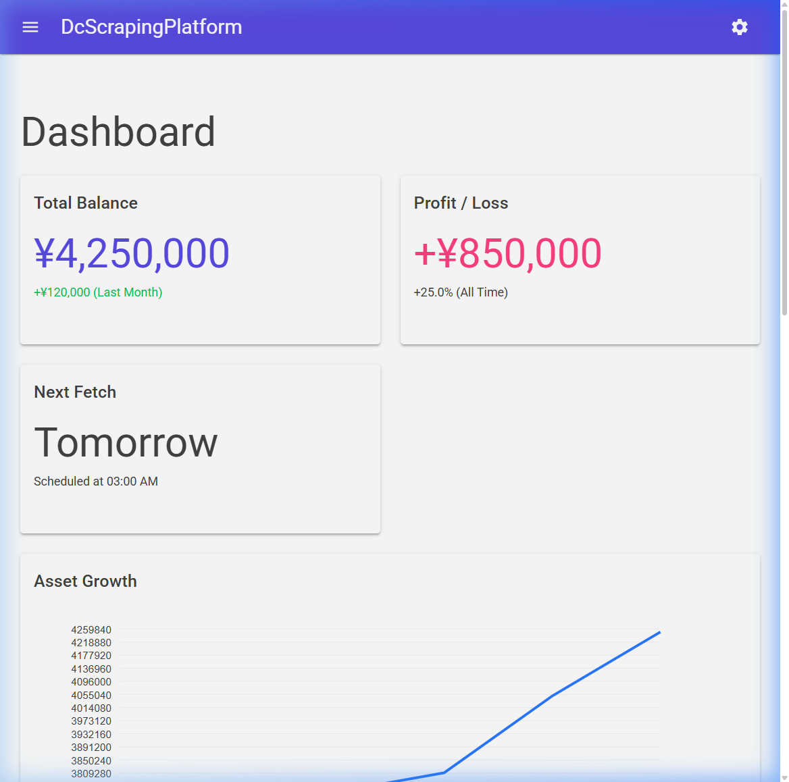
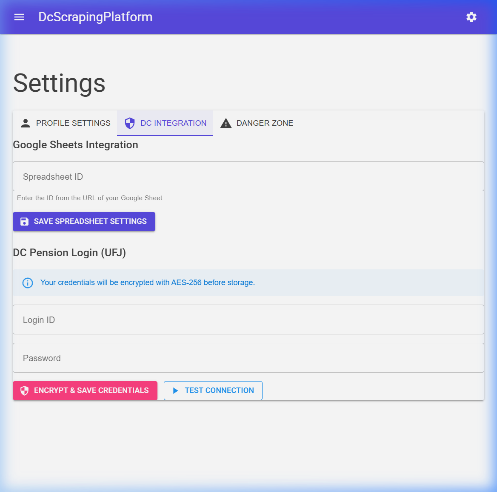
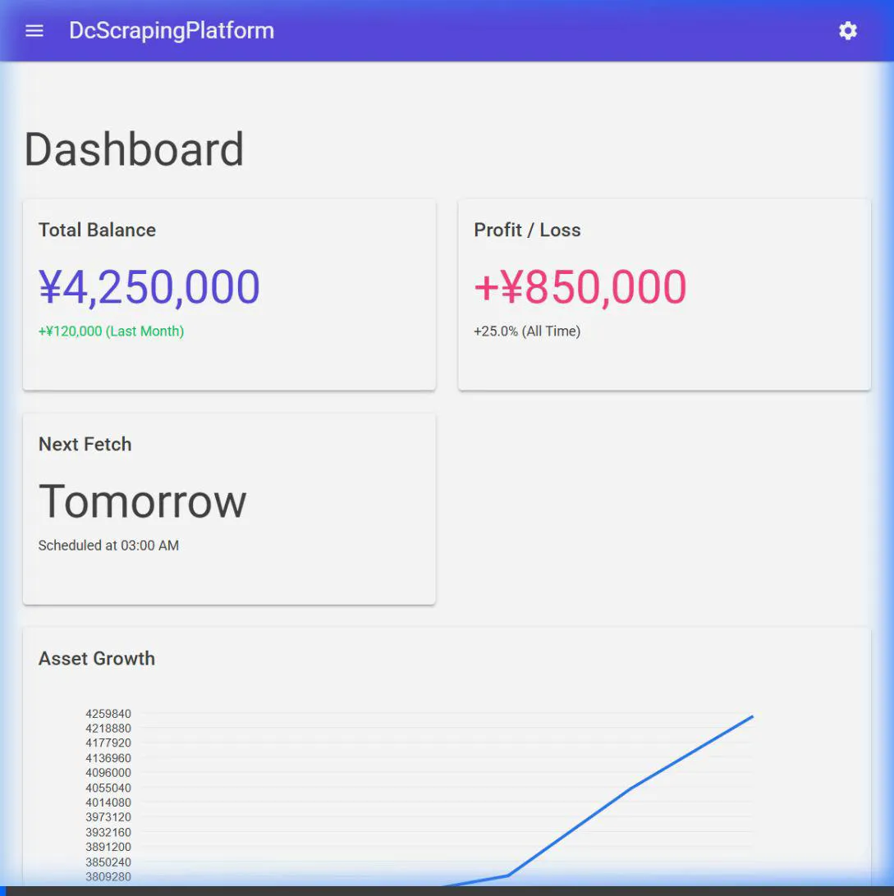

# ローカルデバッグの実施報告

基本設計書・画面設計書に基づき実装した機能が、ローカル環境で正常に動作することを確認しました。デバッグ過程で発見された不具合とその修正内容を以下にまとめます。

## 発見された不具合と修正

### 1. MudBlazor の Provider 不足によるクラッシュ
- **現象**: ホーム画面アクセス時に `InvalidOperationException: Missing <MudPopoverProvider />` が発生。
- **原因**: `MainLayout.razor` に MudBlazor の動作に必要な Provider が不足していた。
- **修正**: `MainLayout.razor` に `<MudPopoverProvider />` を追加。

### 2. クライアント側でのサービス登録漏れ
- **現象**: 設定画面でタブの切り替えが機能しない、または依存関係注入エラーが発生。
- **原因**: `Source/DcScrapingPlatform.Client/Program.cs` で `AddMudServices()` が呼び出されていなかった。
- **修正**: クライアント側の `Program.cs` に `builder.Services.AddMudServices();` を追加。

## 動作確認結果

### ダッシュボード
サマリーカード、グラフ、スクレイピング履歴が期待通りに表示されることを確認しました。

### 設定画面
タブ切り替えにより「Profile Settings」「DC Integration」「Danger Zone」が正常に表示されることを確認しました。

## 検証動画
デバッグ中の操作ログと画面遷移の記録です。

---
以上の修正により、設計書通りの UI と機能がローカル環境で動作する状態になりました。
