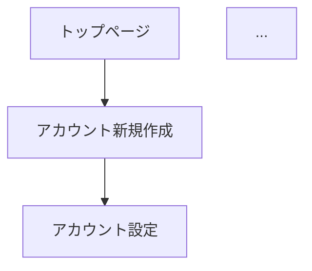

# 画面設計書の画面遷移図更新 - Walkthrough

## 概要
画面設計書の画面遷移図を、最新の要件に合わせて修正しました。これには遷移フローの変更（新規作成後の遷移先設定）と、図内の名称の日本語化が含まれます。

## 実施内容
1. **GitHub Issue 作成**: #28 を作成し、作業内容を紐付け。
2. **専用ブランチ作成**: `feature/#28-画面設計書の更新` にて作業。
3. **遷移図の修正 (`Doc/画面設計書.md`)**:
   - アカウント新規作成後の遷移先を「アカウント設定」に修正。
   - Mermaid 図内のすべてのノード（ID/ラベル）を日本語に統一。
4. **Git 操作**: 変更をコミットし、リモートブランチへプッシュ。

## 検証結果
- **Mermaid レンダリング**: プレビューにて図が正しく表示されることを確認。
- **遷移フローの整合性**: ユーザーからの「新規作成 -> アカウント設定 -> ダッシュボード」という要望通りの図になっていることを確認。

