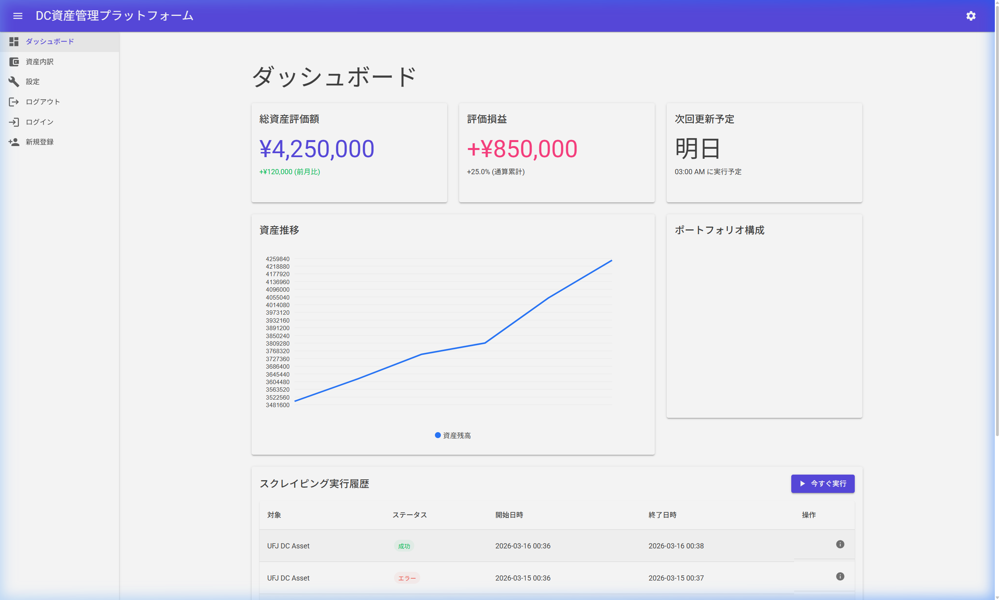
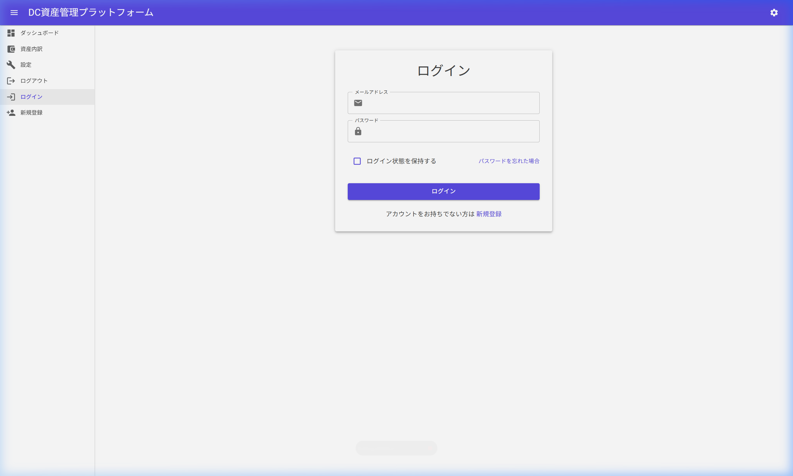
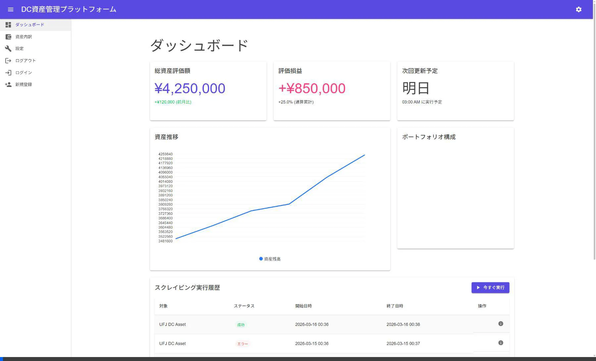

# 画面文言の日本語化対応 - ウォークスルー

## 概要
アプリケーションの全画面における英語文言を日本語に翻訳し、日本国内ユーザー向けの使いやすいインターフェースを提供しました。また、運用ルールに基づき、関連する設計ドキュメント（基本設計書、画面設計書）の更新も同時に実施しました。

## 実施内容

### 1. 画面の日本語化
以下のファイルを修正し、ハードコードされていた英語のラベルやメッセージを日本語に翻訳しました。

- `MainLayout.razor`: ヘッダータイトルを「DC資産管理プラットフォーム」に変更。
- `Home.razor` (ダッシュボード): 
  - メトリクス（総資産、評価損益、次回更新）
  - グラフ（資産推移、資産構成）
  - 履歴テーブル（対象、ステータス、開始/終了日時）
  - 各種ボタン（今すぐ実行）
- `Settings.razor` (設定画面):
  - タブ（プロフィール、連携設定、危険ゾーン）
  - フォームラベル（ユーザー名、メール、スプレッドシートID等）
  - 説明文、警告メッセージ、ボタン。
- `Account/Login.razor` (ログイン画面): 
  - タイトル、入力項目、チェックボックス、パスワードリセット誘導、新規登録誘導、エラーメッセージ。
- `Account/Register.razor` (新規登録画面):
  - タイトル、入力項目、バリデーションエラーメッセージ、ログイン誘導。
- `NavMenu.razor` (サイドバー):
  - Dashboard、Assets、Settings、Logout 等のメニュー項目を日本語化。
- `NotFound.razor` (404ページ):
  - エラーメッセージを日本語化。
- `Program.cs` (DI設定):
  - クライアント側コンポーネントで必要な `HttpClient` のDI登録を追加。

### 2. ドキュメントの更新
運用ルール（設計書の更新義務）に従い、以下のドキュメントを更新しました。

- `Doc/基本設計書.md`: システム説明や機能一覧の用語を日本語表記に統一。
- `Doc/画面設計書.md`: 各画面の構成、入力項目、機能説明を日本語化した実装に合わせて更新。

## 検証フロー

## 検証結果

### 1. 画面表示の確認 (ローカルデバッグ)
ローカルサーバーを起動し、ブラウザで以下の画面が日本語化されていることを確認しました。
- ダッシュボード（サイドバー含む）
- ログイン画面（DIエラーが解消され、正しく表示されることを確認）
- 新規登録画面
- 設定画面
- 404エラーページ

### 2. スクリーンショット

### 3. ビジュアルレポート (動画)

## 作業証跡
- GitHub Issue: [#22](https://github.com/shimizu-tkmt/DcScrapingPlatform/issues/22)
- Pull Request: [作成済み]
- Branch: `feature/#22-画面文言の日本語化対応`
